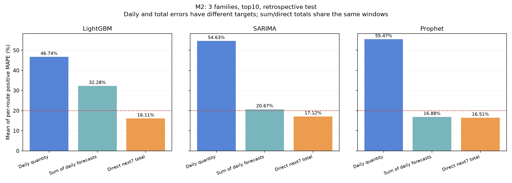

# M2 — báo cáo ngày 07/10/2026

Nhánh: `codex/m2-report-20261007`. Kết quả khóa ngày 06/10; giữ LG U+ chưa đạt để tối ưu sau theo yêu cầu người dùng.

**Lựa chọn theo validation: tổng 7 đạt 9/10 tuyến, MAPE trung bình test 15.89%; ngày 0/10, 46.74%. Độ phủ 100%.**

Test đã xem ở các thử nghiệm trước, nên đây là đánh giá hồi cứu. Tổng 7 không thay R05 ngày; chưa nghiệm thu toàn bài hoặc thay sản phẩm V13/tồn/cảnh báo.

## Dữ liệu và cách đánh giá

Snapshot order được người dùng mô tả là giả định; cơ chế sinh dữ liệu chưa được xác minh độc lập. Nguồn có 100.000 dòng, 93.104 dòng bán hợp lệ, tổng 118.296 quantity và 46 tuyến. Target là quantity của sale success theo ngày đặt UTC, không dùng ngày activation.

| Split top 10 | Thời gian | Dòng tuyến × ngày | Quantity |
|---|---|---:|---:|
| Train | 01/01/2024–30/06/2025 | 5.470 | 40.549 |
| Validation | 01/07/2025–30/09/2025 | 920 | 8.637 |
| Test hồi cứu | 01/10/2025–31/12/2025 | 920 | 7.765 |

Top 10 lấy theo quantity train. Horizon 14 ngày, refit mỗi 7 ngày; kết quả chính h1–7/block 1, h8–14 và cadence 7 ngày ở bảng metric riêng. Chọn theo MAPE validation trên actual dương, rồi MAE và mã biến thể khi hòa; loại candidate thiếu độ phủ, khóa trước khi fit/chấm test. Test đã từng được xem nên kết quả mới vẫn là hồi cứu.

MAPE dưới đây là trung bình giữa 10 tuyến; ngưỡng ≤20% xét từng tuyến. CSV kèm MAE, WAPE, bias, số cặp dương và độ phủ. Mẫu số daily và tổng 7 khác nhau, không dùng mức giảm MAPE giữa hai target để nhận đạt R05 ngày.

## Ba họ và đối chứng trước/sau

| Họ | Ngày cũ → mới | Tổng7 cũ → mới | Tuyến tổng7 đạt cũ → mới |
|---|---:|---:|---:|
| LightGBM | 47.77% → 46.74% | 16.83% → 16.11% | 8 → 8 |
| SARIMA | 54.63% → 54.63% | 16.92% → 17.12% | 8 → 7 |
| Prophet | 57.28% → 55.47% | 26.43% → 16.51% | 3 → 8 |

SARIMA có validation tốt hơn ở tổng7 nhưng test kém hơn; giữ nguyên lựa chọn đã khóa, không chọn lại từ test.

## Lựa chọn từng tuyến và tiêu chí còn thiếu

| Tuyến | Họ | Biến thể tổng7 | MAPE validation | MAPE test |
|---|---|---|---:|---:|
| China / China Mobile | LightGBM | lgbm_annual_l1_15 | 20.33% | 19.73% |
| Japan / NTT Docomo | LightGBM | lgbm_annual_ratio7 | 18.89% | 17.00% |
| Japan / SoftBank | LightGBM | lgbm_weighted_l1 | 20.17% | 15.36% |
| Japan / au (KDDI) | Prophet | prophet_annual3_weekly_w540 | 15.31% | 17.87% |
| South Korea / KT | LightGBM | lgbm_weighted_l1 | 12.62% | 13.69% |
| South Korea / LG U+ | LightGBM | lgbm_cal_ratio7_56_p4 | 11.63% | 20.69% |
| South Korea / SKT | LightGBM | lgbm_poisson | 16.21% | 13.88% |
| Thailand / AIS | LightGBM | lgbm_annual_ratio7 | 13.82% | 12.67% |
| Thailand / TrueMove H | LightGBM | lgbm_annual_l1_15_min50 | 17.84% | 16.46% |
| Thailand / dtac | LightGBM | lgbm_annual_ratio7 | 10.23% | 11.53% |

Tổng7 còn chưa đạt: **South Korea / LG U+: 20.69%**. Không đổi ngưỡng20% để nhận đạt.

Cộng dự báo ngày Prophet thành tổng 7 đạt 9/10, MAPE 16.88%. Đây là quan sát test bổ sung; không dùng để đổi lựa chọn giữa hai quy trình sau khi xem test.

## Độ ổn định validation tháng 7/8/9

Giữ nguyên lựa chọn toàn kỳ; chỉ chấm các cửa sổ có đủ nhãn trong từng tháng. MAPE dưới đây là trung bình theo tuyến, block 1, mọi origin ngày; không dùng bảng tháng để chọn lại mô hình.

| Họ / lựa chọn | Mục tiêu | Tháng 7 | Tháng 8 | Tháng 9 |
|---|---|---:|---:|---:|
| LightGBM | Ngày | 39.11% (0/10) | 37.43% (0/10) | 53.80% (0/10) |
| LightGBM | Tổng 7 | 14.85% (9/10) | 14.57% (9/10) | 18.58% (7/10) |
| SARIMA | Ngày | 40.33% (0/10) | 40.65% (0/10) | 86.67% (0/10) |
| SARIMA | Tổng 7 | 15.48% (9/10) | 14.38% (9/10) | 37.63% (0/10) |
| Prophet | Ngày | 39.70% (1/10) | 40.90% (0/10) | 94.95% (0/10) |
| Prophet | Tổng 7 | 15.30% (9/10) | 15.14% (8/10) | 37.44% (1/10) |
| Phối hợp từng tuyến | Ngày | 39.11% (0/10) | 37.43% (0/10) | 53.80% (0/10) |
| Phối hợp từng tuyến | Tổng 7 | 14.96% (9/10) | 14.16% (9/10) | 18.70% (7/10) |

Lựa chọn phối hợp tổng 7 giảm độ ổn định trong tháng 9: MAPE 18,70%, 7/10 tuyến đạt, so với 14,96% và 14,16%, cùng 9/10 ở tháng 7 và 8. Dự báo ngày cũng tăng lỗi trong tháng 9. Đây là giới hạn cần trình bày khi bảo vệ M2.

## Hai phương pháp và lựa chọn cho M2

| Phương pháp | Ưu điểm | Hạn chế |
|---|---|---|
| Dự báo từng ngày rồi cộng | Có lịch nhu cầu từng ngày để lập kế hoạch giao và vận hành; dùng cùng mô hình cho nhiều khoảng cộng | Nhiễu ngày và sai lệch có thể tích lũy. Tiêu chí ngày vẫn chưa đạt; lựa chọn tốt theo ngày chưa chắc tốt theo tổng |
| Dự báo trực tiếp tổng 7 | Khớp quyết định đặt/nhập theo tuần; làm phẳng biến động ngày, kết quả hiện tại tốt hơn về MAPE tổng ở cả ba họ | Chưa cho nhu cầu từng ngày; phân bổ xuống ngày cần kiểm riêng. Các tổng trượt chồng lấn nên báo thêm cadence 7 ngày |

Ưu tiên tổng 7 trực tiếp với mô hình chọn bằng validation từng tuyến: LightGBM cho 9 tuyến và Prophet cho au (KDDI). SARIMA tiếp tục là đối chứng. Giữ bảng ngày riêng cho R05; chưa thay pipeline sản phẩm. Các cấu hình thử nghiệm và hướng dẫn mở rộng ở [LightGBM](../../models/LightGBM/README.md), [SARIMA](../../models/SARIMA/README.md), [Prophet](../../models/Prophet/README.md).

## Triển khai và kiểm chứng

- 12 biến thể đối chứng + 14 mới, 26 biến thể/50 cấu hình ngày–tổng 7, 500 ứng viên tuyến × cấu hình validation. Hai calibration chỉ tổng 7, history 56/prior 4/bounds 0.5..1.5. Tối đa 3 worker; nhãn, split, top 10, H14, refit 7 và quy tắc lựa chọn giữ nguyên.
- 40 kiểm tra liên quan đạt; 24 so sánh trên fixture 9 origin/2 refit khớp đối chứng. 176.640 dòng validation của 12 biến thể cũ giữ nguyên; 583 tệp lịch sử và raw nguyên hash.
- Verifier phát hiện lỗi biến end ghi đè cutoff chấm điểm ở hai calibration trong lượt đầu. Lượt lỗi được giữ nguyên với marker invalid_actual_metadata; không dùng kết quả đó để bàn giao.
- Run sửa kiểm source/config/audit tương đương trước khi dùng cache forecast validation; dựng lại actual từ audit mới, tính lại metric/lựa chọn rồi khóa trước test fit mới. 356.960 dòng validation giữ nguyên forecast, actual đối chiếu độc lập đầy đủ. Không tái sử dụng test hoặc lựa chọn của lượt lỗi.
- Đối soát độc lập: 401,600 dòng dự báo/9,160 nhóm metric; 2 candidate lỗi có log và bị loại; mọi lựa chọn test/future có đủ độ phủ. Nhãn/factor/teacher/selection/metric/tương lai actual trống đều đạt.
- Phần mềm và báo cáo hoàn tất sớm trong ngày 06/10; mốc bàn giao M2 vẫn 17/10. Full suite local sau clean đạt 262 tests, 14 tests liên quan chạy lại sau sửa path UI đạt; CI của nhánh mới và diễn tập máy thứ hai chưa xác minh; notebook/report local là phần demo M2. Không tạo lại Word/slide hoặc chuyển sản phẩm hiện hành.

## Biểu đồ và bằng chứng kèm báo cáo

- [Bản HTML offline](index.html): tải về và mở bằng trình duyệt, biểu đồ đã nhúng; GitHub không chạy HTML trực tiếp.
- [Mô hình tổng 7 từng tuyến](selected_weekly_routes.csv) và [mô hình ngày từng tuyến](selected_daily_routes.csv).
- [Khóa lựa chọn](overall_selected_models.csv), [metric test đầy đủ](overall_test_metrics.csv), [tổng hợp ba họ](summary.csv).
- [Validation tháng của phối hợp](validation_monthly_mix.csv), [validation tháng từng họ/tuyến](validation_monthly_selected.csv).
- [So sánh trước/sau từng tuyến](before_after_routes.csv), [so sánh hai phương pháp từng tuyến](route_comparison.csv), [hash đối soát](evidence.json).
- [Kịch bản trình bày 7–10 phút](../presentation-guide.md), [cấu trúc M2](../../README.md).

Báo cáo và bảng tổng hợp này được chia sẻ lên GitHub theo yêu cầu người dùng. Dữ liệu gốc, bảng train từng ngày, forecast từng origin, fit logs và artifact run giữ local. Không train lại, đổi lựa chọn hoặc tối ưu LG U+ trong lần xuất bản này.

Run nguồn: `m2_improved_models_20261006_fixed`; manifest SHA `6407c68e9f520da51924fb021a275a947ada9cca15fbde06f35287218f3561dc`. Khóa lựa chọn SHA `98eb1ea7fa468f082424e429702dd8f6e85126b665540d17759ae5b19d32b48f`.
